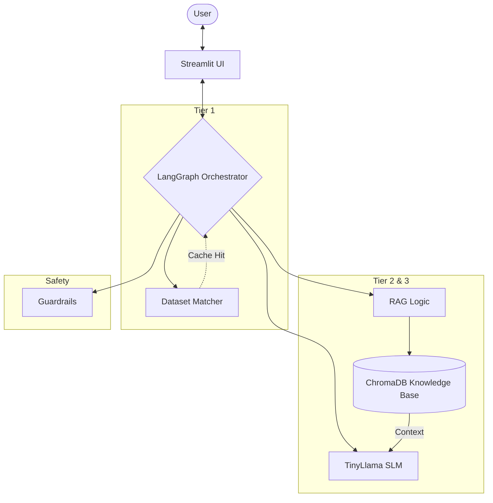
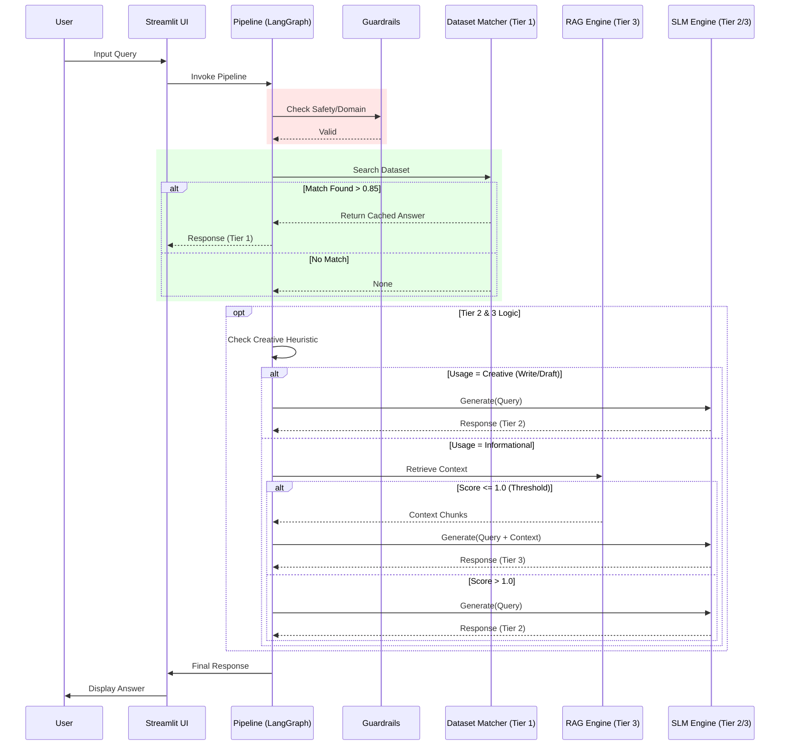

# BFSI Call Center AI Assistant - Design Document

## 1. Executive Summary

The **BFSI Call Center AI Assistant** is a local, privacy-focused conversational agent designed to handle banking, financial services, and insurance queries. It leverages a **Small Language Model (SLM)** approach to run efficiently on consumer hardware (RTX 3070) while maintaining high accuracy through a hybrid **3-Tier Response Pipeline**.

## 2. System Architecture

The system is orchestrated by **LangGraph**, which routes user queries through three distinct tiers based on complexity and data availability.

### 2.1. High-Level Architecture



```mermaid
graph TD
    User[User via Streamlit] --> Guard[Guardrails (Safety & Domain Check)]
    Guard -->|Blocked| End[Rejection Response]
    Guard -->|Valid| Tier1[Tier 1: Dataset Matcher]

    Tier1 -->|High Similarity > 0.85| End
    Tier1 -->|No Match| Tier2_Check{Is Creative Task?}

    Tier2_Check -->|Yes (Write/Draft)| Tier2[Tier 2: Pure SLM Generation]
    Tier2_Check -->|No| RAG_Check[RAG Retrieval]

    RAG_Check -->|Relevance > 1.0| Tier3[Tier 3: RAG Augmented SLM]
    RAG_Check -->|Low Relevance| Tier2

    Tier2 --> Post[Post-Processing]
    Tier3 --> Post
    Post --> End
```

### 2.2. Request Flow Sequence



### 2.1. The 3-Tier Pipeline

| Tier       | Component           | Description                                                                                                                                                                                       | Technologies                                          |
| :--------- | :------------------ | :------------------------------------------------------------------------------------------------------------------------------------------------------------------------------------------------ | :---------------------------------------------------- |
| **Tier 1** | **Dataset Matcher** | Handles common, static queries (e.g., "How to check balance?") by finding exact or near-exact matches in a curated dataset. Extremely fast and hallucination-free.                                | `SentenceTransformers`, `Cosine Similarity`           |
| **Tier 2** | **SLM Engine**      | Handles general domain queries (e.g., "Write an email to the manager") using a fine-tuned TinyLlama model. Optimized for instruction following and polite conversational flow.                    | `TinyLlama-1.1B-Chat` (QLoRA), `PEFT`, `Transformers` |
| **Tier 3** | **RAG Engine**      | Handles specific factual queries (e.g., "What is the UPI Lite limit?") by retrieving up-to-date context from the Knowledge Base. grounded generation prevents hallucinations on numbers/policies. | `ChromaDB`, `LangChain`, `HuggingFaceEmbeddings`      |

## 3. Technology Stack

### Core AI & Logic

- **Base Model:** `TinyLlama/TinyLlama-1.1B-Chat-v1.0` (1.1 Billion Parameters)
- **Fine-Tuning:** QLoRA (Quantized Low-Rank Adaptation) 4-bit quantization via `bitsandbytes` and `peft`.
- **Orchestration:** `LangGraph` (State Machine) & `LangChain`.
- **Embeddings:** `sentence-transformers/all-MiniLM-L6-v2`.

### Infrastructure

- **Vector Store:** `ChromaDB` (Persistent local storage).
- **UI Framework:** `Streamlit`.
- **Observability:** `LangSmith` (Tracing and monitoring).
- **Environment:** Python 3.9+, CUDA 12.x (Windows).

## 4. Key Components

### 4.1. Guardrails

A safety layer that intercepts queries _before_ they reach the model.

- **Function:** Blocks unsafe content (violence, illegal acts) and out-of-domain queries (e.g., "coding help", "cooking recipes").
- **Implementation:** Keyword filtering and heuristic classification.

### 4.2. Heuristic Routing

To optimize performance, the system uses "Fast Path" heuristics:

- **Creative Bypass:** Queries starting with "Write", "Draft", or "Compose" skip the RAG retrieval step to prevent context stuffing, ensuring the SLM can generate clean, improved text.

### 4.3. Data Management

- **Dataset:** `alpaca_bfsi_dataset.json` contains 150+ valid Q&A pairs for fine-tuning and Tier 1 matching.
- **Knowledge Base:** Markdown files in `data/knowledge_base/` cover policies, rates, and digital banking docs.

## 5. Security & Privacy

- **Local Execution:** No data is sent to external cloud LLM providers (OpenAI/Anthropic). All inference happens on the local GPU.
- **Sanitization:** Guardrails ensure the bot does not generate harmful content.
- **Role-Based Access (Future):** Design supports adding user-level authentication in the Streamlit UI.

## 6. Performance Characteristics

- **Startup Time:** ~60 seconds (Model Loading).
- **Tier 1 Latency:** < 50ms (Instant).
- **Tier 2/3 Latency:** 2-5 seconds (dependent on GPU).
- **VRAM Usage:** ~2.2 GB (High efficiency due to 4-bit QLoRA).
