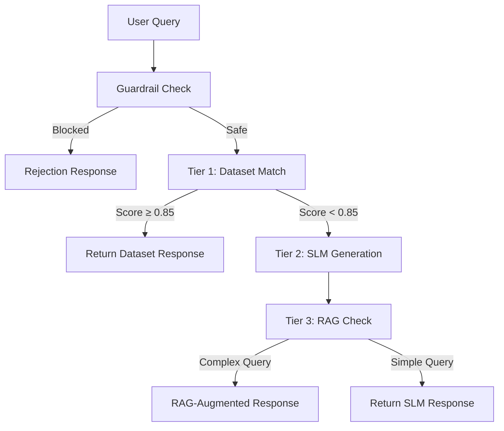

# BFSI Call Center AI Assistant — Implementation Plan

Build a lightweight, compliant AI assistant for BFSI call center queries. Uses a **3-tier response pipeline** orchestrated by **LangGraph**, with **LangSmith** observability, running locally on RTX 3070 (8GB VRAM).

**Model**: TinyLlama-1.1B-Chat (confirmed) with QLoRA 4-bit fine-tuning.

---

## Proposed Changes

### Project Structure

```
d:\BFSI Chatbot\
├── data/
│   ├── alpaca_bfsi_dataset.json        # 160+ Alpaca-format samples
│   └── knowledge_base/                 # RAG source documents (5 .md files)
├── src/
│   ├── __init__.py
│   ├── config.py                       # Config + LangSmith setup
│   ├── dataset_matcher.py              # Tier 1: LangChain embeddings + similarity
│   ├── slm_engine.py                   # Tier 2: LangChain HuggingFace LLM wrapper
│   ├── rag_engine.py                   # Tier 3: LangChain retriever + ChromaDB
│   ├── guardrails.py                   # Safety filters (LangChain output parser)
│   └── pipeline.py                     # LangGraph state graph orchestrator
├── scripts/
│   ├── train.py                        # QLoRA fine-tuning (TRL + PEFT)
│   └── build_vectorstore.py            # Build ChromaDB with LangChain loaders
├── app.py                              # Streamlit chat UI
├── .env                                # LangSmith API keys
├── requirements.txt
└── README.md
```

---

### LangChain / LangGraph / LangSmith Integration

| Component                   | LangChain/LangGraph Usage                                                                               |
| --------------------------- | ------------------------------------------------------------------------------------------------------- |
| **Tier 1 – Dataset Match**  | `langchain_community.embeddings.HuggingFaceEmbeddings` for similarity computation                       |
| **Tier 2 – SLM Generation** | `langchain_huggingface.HuggingFacePipeline` wrapping the fine-tuned TinyLlama                           |
| **Tier 3 – RAG**            | `langchain_community.document_loaders`, `langchain_chroma` vector store, `langchain.chains.RetrievalQA` |
| **Pipeline Orchestrator**   | `langgraph.graph.StateGraph` with conditional edges routing through Tier 1→2→3                          |
| **Guardrails**              | LangChain `RunnableLambda` for input/output filtering                                                   |
| **Observability**           | LangSmith tracing via `LANGCHAIN_TRACING_V2=true` env var — auto-traces all chains                      |

### LangGraph Pipeline Flow



---

### Phase-by-Phase Summary

#### Phase 1: Foundation

- [requirements.txt](file:///d:/BFSI%20Chatbot/requirements.txt) — adds `langchain`, `langchain-community`, `langchain-huggingface`, `langchain-chroma`, `langgraph`, `langsmith` plus PyTorch, Transformers, PEFT, TRL, etc.
- [.env](file:///d:/BFSI%20Chatbot/.env) — `LANGCHAIN_TRACING_V2`, `LANGCHAIN_API_KEY`, `LANGCHAIN_PROJECT`

#### Phase 2: Dataset

- [alpaca_bfsi_dataset.json](file:///d:/BFSI%20Chatbot/data/alpaca_bfsi_dataset.json) — 160+ BFSI samples in `{instruction, input, output}` format

#### Phase 3: RAG Knowledge Base

- 5 knowledge docs in `data/knowledge_base/`
- [build_vectorstore.py](file:///d:/BFSI%20Chatbot/scripts/build_vectorstore.py) — LangChain `TextLoader` + `RecursiveCharacterTextSplitter` → ChromaDB

#### Phase 4: Fine-Tuning

- [train.py](file:///d:/BFSI%20Chatbot/scripts/train.py) — QLoRA (4-bit) fine-tuning of TinyLlama-1.1B-Chat on Alpaca dataset using TRL `SFTTrainer`

#### Phase 5: Inference Pipeline

- [dataset_matcher.py](file:///d:/BFSI%20Chatbot/src/dataset_matcher.py) — Tier 1 with `HuggingFaceEmbeddings`
- [slm_engine.py](file:///d:/BFSI%20Chatbot/src/slm_engine.py) — Tier 2 with `HuggingFacePipeline`
- [rag_engine.py](file:///d:/BFSI%20Chatbot/src/rag_engine.py) — Tier 3 with `Chroma` retriever + `RetrievalQA`
- [guardrails.py](file:///d:/BFSI%20Chatbot/src/guardrails.py) — Input/output safety filters
- [pipeline.py](file:///d:/BFSI%20Chatbot/src/pipeline.py) — **LangGraph `StateGraph`** orchestrating all tiers with conditional routing

#### Phase 6: UI

- [app.py](file:///d:/BFSI%20Chatbot/app.py) — Streamlit chat with tier indicator, response time, and LangSmith trace links

---

## Verification Plan

### Automated Tests

1. Dataset validation: verify 150+ samples, correct Alpaca format
2. Vector store build: `build_vectorstore.py` creates `data/chroma_db/`
3. Pipeline smoke test: query the pipeline and verify response + tier metadata

### Manual Verification

- "What is the eligibility for a home loan?" → Tier 1 match
- "Calculate EMI for 20 lakh at 8.5% for 15 years" → Tier 3 RAG
- "What is the capital of France?" → Guardrail rejection
- Verify traces appear in LangSmith dashboard
